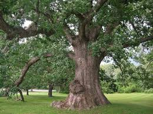

Welcome to **TreeLife**, your guide to learning about the beauty,diversity, and importance of trees around the world.

-----
### About Us
At **TreeLife**, we're passionate about forests and green living.

Our mission is to :
- educate people about diffrent types of trees.
- Promotesustainable foresty.
- Encourage reforestaion projects.

"The Best time to plant a tree was 20 years ago.The sencond best time is now."

-chiese proverb
---
### Featured trees

#### Oak Tree
**scientific Name**:*Quercus robur*

Known for its strenght and longevity,the oak is a symbol of endurance



---
#### Pine Tree 
**Scientific Name**: *Pinus*

Evergreen and aromatic,pine trees thrive in colder regions


---

### Tree Idenfification Tool

you can use simple **javascript** funtion to identify a tree by its charatcteristics:
```
funtion identify_tree(leaf_shape, region){
if(leaf_shape==""needle"&& region== "cold"){
  return "pine tree" }
 } else if(leaf_shape=="broad"&& region == "temperate"){
  return "oak tree"
 }else
  {return "unkown Tree"
 }
}
console.log(identify_tree("needle", "cold)
```